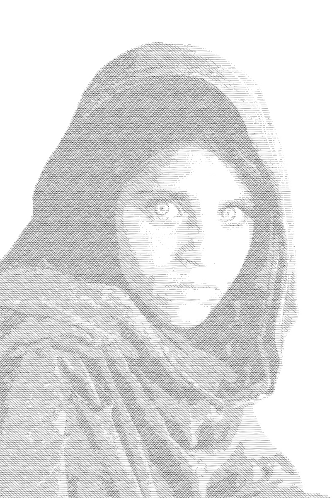

# Crosshatch

Turn portrait photos into crosshatch drawings using automatic segmentation and hatch pattern blending.

## What is Crosshatching?

Crosshatching is a drawing technique where layers of parallel lines are overlaid at different angles to create tonal effects. Artists use denser, overlapping hatches for dark areas and sparse hatches for light areas. This project automates that process: segment the subject, analyze its tonal range, and map hatch textures onto different brightness zones.

## How It Works

1. **Segment** the subject from the background using rembg
2. **Resize** the image to match the hatch texture dimensions
3. **Layer** the subject onto a white background
4. **Analyze** the tonal range via histogram and compute threshold boundaries
5. **Apply** a different hatch pattern to each tonal region
6. **Blend** the hatch layers into the final crosshatch drawing

## How to Use

### Web App (recommended)

1. Go to **[joeljose.github.io/Crosshatch](https://joeljose.github.io/Crosshatch/)**
2. Drop a portrait photo or click to browse
3. Choose a hatch style and click **Process**
4. Download the result as JPG or PNG

Everything runs in your browser — no images are uploaded to any server.

### Colab Notebook

1. Click the **"Open in Colab"** badge above
2. Run all cells
3. Upload your portrait to the Crosshatch folder via the sidebar
4. Download the result

## Hatch Styles

| Style | Description |
|-------|-------------|
| **Horizontal** | Classic parallel lines — clean, traditional look |
| **Vortex** | Circular swirl pattern — more artistic and dynamic |

## Follow Me

## License

[MIT](LICENSE)
